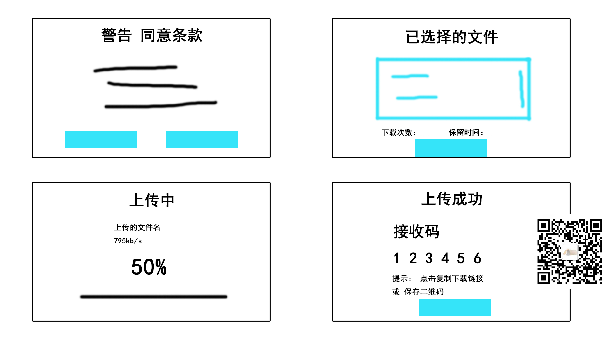

# 选择文件提示框原型 及逻辑

## 页面元素说明

### 弹窗1
| 序号 | 项目名 | 类别 | 说明 |
| - | - | - | - | - |
| 1 | 同意 | 按钮 | 点击后 展示弹窗2 |
| 2 | 放弃 | 按钮 | 点击后 关闭弹窗 |

### 弹窗2
| 序号 | 项目名 | 类别 | 说明 |
| - | - | - | - | - |
| 1 | 上传 | 按钮 | 点击后 上传文件 |
| 2 | 下载次数 | 输入框 | 只允许输入正整数 |
| 3 | 保留时间 | 输入框 | 单位小时 只允许输入正整数 |
| 4 | 上传 | 按钮 | 点击上传 展示弹窗3 |
| 5 | 已选择的文件 | 列表 | 展示已选择的文件 展示大小信息 点击其中某一项可以替换文件 替换完成后 重新展示此弹窗 |

### 弹窗3
| 序号 | 项目名 | 类别 | 说明 |
| - | - | - | - | - |
| 1 | 进度条 | 进度条 | 展示上传文件的进度 进度条为100%时 展示弹窗4 |
| 2 | 展示信息 | 文本 | 展示上传文件名，上传速度， 预计消耗时间 |

### 弹窗4
| 序号 | 项目名 | 类别 | 说明 |
| - | - | - | - | - |
| 1 | 接收码 | 文本 | 鼠标放上时变成手型文本颜色变成蓝色，点击时复制，并作出提示已经复制 |
| 2 | 提示 | 文本 | 点击下载链接时复制，点击二维码扫描时 展示二维码 |
| 3 | 完成 | 按钮 | 点击时关闭弹窗， 如果用户未登录，做出提示：登陆后可上传多个文件 | 

