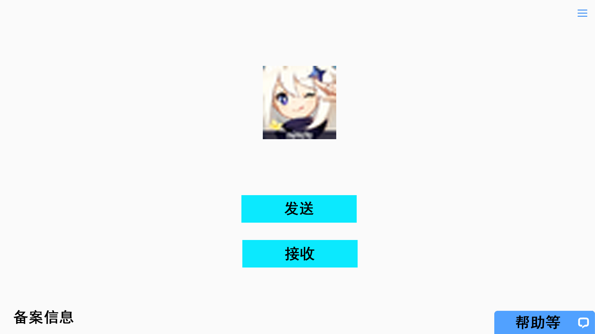
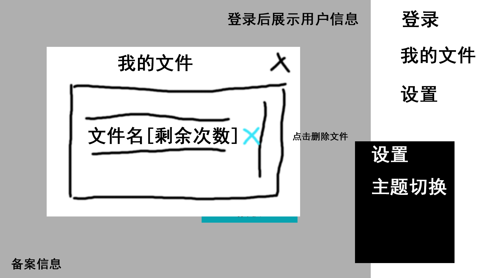

# 首页原型 及逻辑

首页

菜单

## 页面元素说明

### 首页
| 序号 | 项目名 | 类别 | 说明 |
| - | - | - | - | - |
| 1 | [发送](./%E9%80%89%E6%8B%A9%E6%96%87%E4%BB%B6%E6%8F%90%E7%A4%BA%E6%A1%86.md) | 按钮 | 点击后弹出 选择文件提示框 默认只支持单选文件 |
| 2 | 接收 | 按钮 | 点击后弹出 接收文件提示框 |
| 3 | 菜单 | 按钮 | 点击后 弹出菜单 |
| 4 | 帮助 | 按钮 | 点击后 弹出帮助 |
| 5 | 备案信息 | 文本 | - |

### 首页
| 序号 | 项目名 | 类别 | 说明 |
| - | - | - | - | - |
| 1 | 发送 | 按钮 | 点击后弹出 选择文件提示框 默认只支持单选 |
| 2 | 接收 | 按钮 | 点击后弹出 接收文件提示框 |
| 3 | 菜单 | 按钮 | 点击后 弹出菜单 |
| 4 | 帮助 | 按钮 | 点击后 弹出帮助 |
| 5 | 备案信息 | 文本 | - |

### 菜单
| 序号 | 项目名 | 类别 | 说明 |
| - | - | - | - | - |
| 1 | 登录 | 按钮 | 点击后弹出登录页面 如果已登录 改为展示用户信息 |
| 2 | 我的文件 | 按钮 | 点击后展示我的文件弹窗， 可以删除已经上传的文件，点击剩余下载次数可以修改 | 
| 3 | 设置 | 按钮 | 点击后弹出 设置弹窗 |